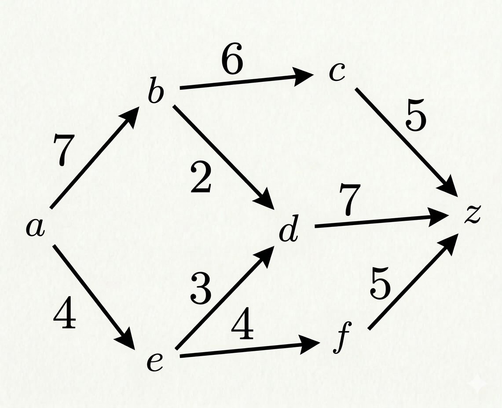
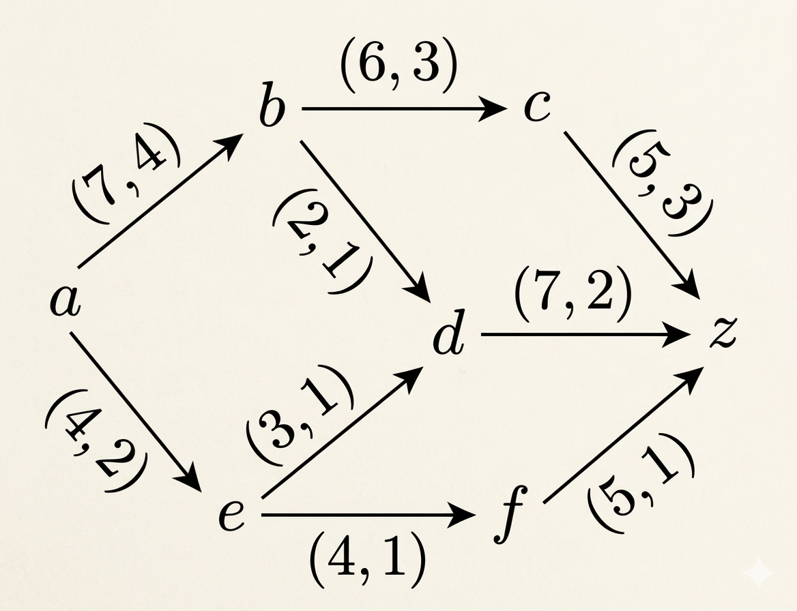
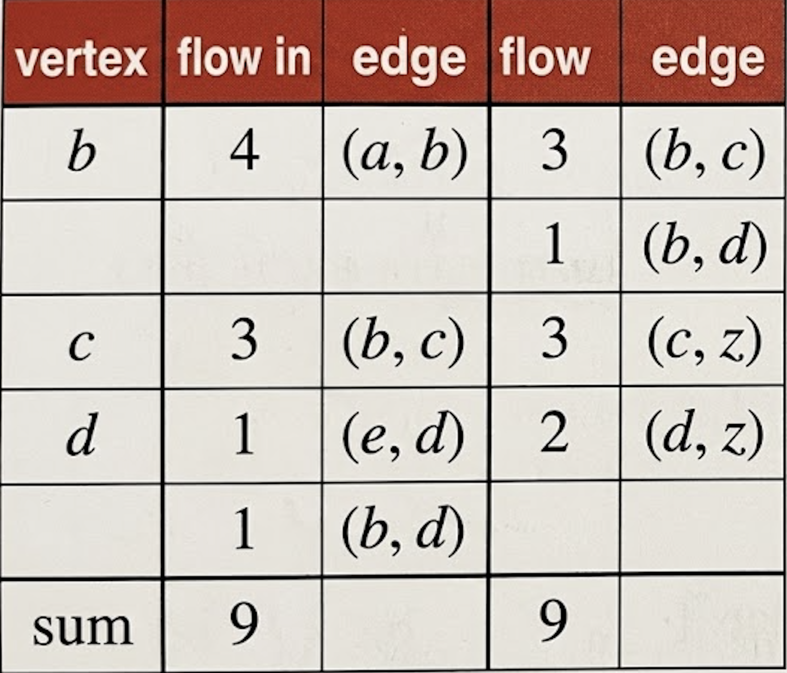
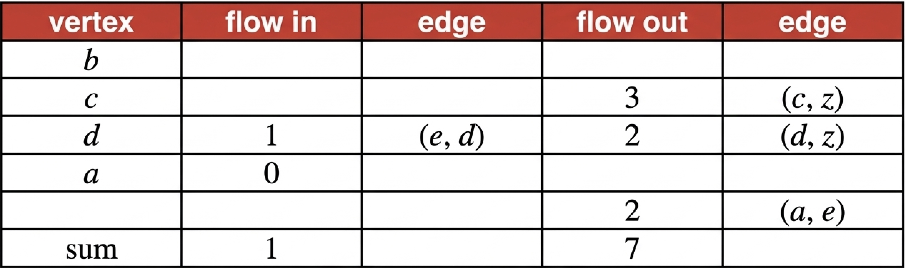
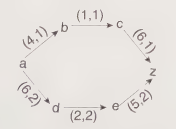
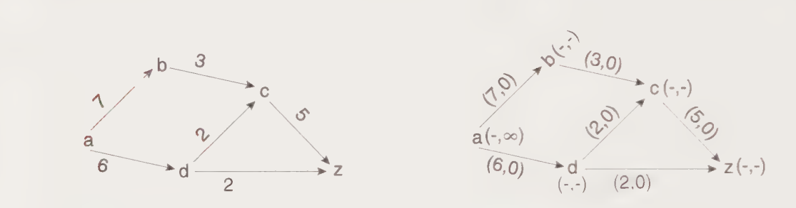
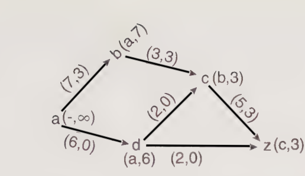
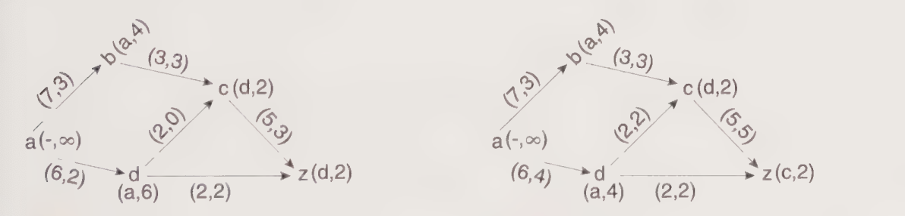
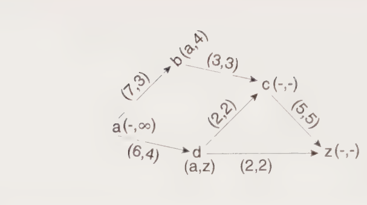
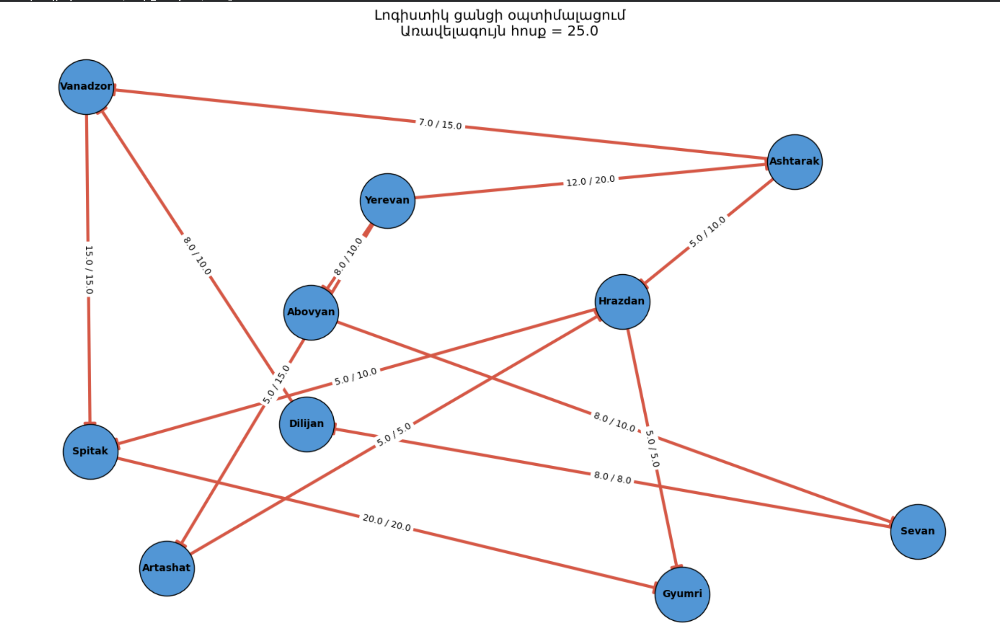

Բովանդակություն

[ՆԵՐԱԾՈԻԹՅՈԻՆ](#ներածոիթյոին)..............................................................................................3

**ԳԼՈՒԽ 1. Գրաֆների տեսության հիմնական սահմանումներ**

[§ 1.1 Գրաֆի սահմանումը, տեսակները և տրման եղանակները .................................6](#գրաֆի-սահմանումը-տեսակները-և-տրման-եղանակները)

[§ 1.2 Աստիճաններ, ենթագրաֆներ և ճանապարհներ...............................................9](#աստիճաններ-ենթագրաֆներ-և-ճանապարհներ)

[§ 1.3.Կապակցվածության բաղադրիչներ և կապակցված գրաֆներ, Երկկողմանի գրաֆներ,Ծառեր\...\...\...\...\...\...\...\...\...\...\...\...\...\...\...\...\...\...\...\...\...\....](#կապակցվածության-բաղադրիչներ-և-կապակցված-գրաֆներ-երկկողմանի-գրաֆներ-ծառեր)\...\...\...\...\...\...\...\...\...\...\....13

**ԳԼՈՒԽ 2. Հոսքերի Տեսություն**

[§ 2.1. Ցանցեր և Հոսքեր...................................................................................\.....16](#_§_2.1._ՑԱՆՑԵՐ)

[§ 2.2. Ֆորդ-Ֆալկերսոն Մաքսիմալ Հոսքի Ալգորիթմ......................................\...\...\...\....26](#ֆորդ-ֆալկերսոն-մաքսիմալ-հոսքի-ալգորիթմ)

**ԳԼՈՒԽ 3: Լոգիստիկ ցանցի օպտիմալացման ծրագրային իրականացում**

[§ 3.1 Լոգիստիկ ցանցերի մոդելավորման ընդհանուր մոտեցում.....................................31](\l)

[§ 3.2 Ծրագրային իրականացման ընդհանուր կառուցվածքը...........................................32](#ծրագրային-իրականացման-ընդհանուր-կառուցվածքը)

[§ 3.3 Օրինակային կիրառություն լոգիստիկ ընկերության համար..................................34](#օրինակային-կիրառություն-լոգիստիկ-ընկերության-համար)

[§ 3.4 Արդյունքների վերլուծություն....................................................................................36](#արդյունքների-վերլուծություն)

# ՆԵՐԱԾՈԻԹՅՈԻՆ

**  **Ժամանակակից աշխարհում տնտեսական համակարգերի, բիզնես գործընթացների և մատակարարման շղթաների արագ զարգացումը առաջ է բերում կառավարման նոր մեթոդների և արդյունավետության առավել բարձր պահանջներ։ Լոգիստիկան, որպես նյութական, տեղեկատվական և ֆինանսական հոսքերի կազմակերպման գիտություն, դարձվել է մի ոլորտ, որտեղ օպտիմալությունը ոչ միայն ցանկալի, այլև անհրաժեշտ պայման է մրցունակություն ապահովելու համար։ Արտադրական ցիկլերի բազմաբնույթ լինելը, միջազգային առևտրի ընդլայնումը, ինչպես նաև հաճախորդների սպասումներն արագ և ճշգրիտ սպասարկման նկատմամբ, լոգիստիկ համակարգերից պահանջում են ճկունություն, հաշվարկելիություն և օպտիմալ լուծումների կառուցվածքային մշակում։

Այս համատեքստում մեծ կարեւորություն է ստանում գրաֆների տեսությունը՝ մաթեմատիկայի մի ճյուղ, որը ուսումնասիրում է օբյեկտների միջև կապերը և դրանց կառուցվածքը։ Գրաֆները հնարավորություն են տալիս իրական համակարգերը ներկայացնել ֆորմալ և հստակ մոդելի միջոցով, որտեղ հանգուցները ներկայացնում են օբյեկտներ (ավտոմոբիլային հանգույցներ, պահեստներ, արտադրական կայաններ), իսկ կողերը՝ դրանց միջև կապերը կամ երթուղիները։ Սակայն, այս մոդելների առավել արդյունավետ կիրառման համար անհրաժեշտ է դիտարկել ոչ միայն կապերի գոյությունը, այլև դրանցով անցնող հոսքերի քանակը, ուղղվածությունը և սահմանափակումները։ Այստեղ ի հայտ է գալիս հոսքերի տեսությունը՝ գրաֆների կարևորագույն ենթաճյուղերից մեկը, որը զբաղվում է աղբյուրից նպատակակետ ուղղված հոսքերի օպտիմալ տեղափոխման խնդիրներով։

Հոսքերի տեսությունը հնարավորություն է տալիս մոդելավորել և հաշվարկել այնպիսի իրավիճակներ, որտեղ առկա են սահմանափակ ռեսուրսներ, տարանցման հզորության սահմանափակումներ, պահանջարկի և մատակարարման անհամաչափ բաշխումներ։ Լոգիստիկայում այս մաթեմատիկական մոդելները լայնորեն կիրառվում են՝ տարանցիկ բեռնափոխադրումների պլանավորումից մինչև պահեստների միջև ապրանքների բաշխում, տրանսպորտային ցանցերի բեռնաթափում, ճանապարհային երթևեկության օպտիմալացում, ինչպես նաև մատակարարման շղթաների ընդհանուր արդյունավետության բարձրացում։ Այս տեսության կենտրոնական խնդիրներից են առավելագույն հոսքի, նվազագույն ծախսի հոսքի, բաշխման հոսքերի խնդիրները, որոնք լոգիստիկ կառավարման մեջ ունեն իրագործվող ու չափելի կիրառություններ։

Տնտեսական գործունեության ավտոմատացման և թվայնացման գործընթացների արագ զարգացումը հանգեցրել է նրան, որ բարդ լոգիստիկ համակարգերը հաճախ վերլուծվում են ոչ թե ինտուիտիվ մոտեցումներով, այլ ճշգրիտ մաթեմատիկական մոդելներով։ Հոսքերի տեսության մեթոդները հնարավորություն են տալիս գնահատել երթուղիների ծանրաբեռնվածությունը, հաշվարկել օպտիմալ տեղափոխման ծավալները, մինիմալացնել ժամանակային և ֆինանսական ծախսերը։ Օրինակ՝ բեռնափոխադրման ցանցում առավելագույն հոսքի հաշվարկը թույլ է տալիս հասկանալ, թե ինչքան բեռ կարող է իրականում անցնել տրանսպորտային համակարգով՝ հաշվի առնելով յուրաքանչյուր ճանապարհահատվածի թողունակությունը։ Իսկ նվազագույն ծախսի հոսքի մոդելը կարող է կառուցել այնպիսի բաշխում, որը ապահովում է բեռների տեղափոխման նվազագույն ընդհանուր արժեքը։ Այսպիսով, հոսքերի տեսությունը դառնում է լոգիստիկ որոշումների ընդունման վերլուծական հիմքը՝ ապահովելով մոդելների ճշգրտություն և գործնական կիրառելիություն։

Բացի դրանից, գլոբալ մրցակցության աճը ստիպում է ձեռնարկություններին առավել մեծ ուշադրություն դարձնել մատակարարման շղթայի օպտիմալացմանը։ Ապրանքի վերջնական արժեքի մեջ զգալի մասը կազմում են լոգիստիկ ծախսերը, իսկ դրանց նվազեցման արդյունավետ եղանակները հաճախ հիմնված են հենց գրաֆային և հոսքային մոդելների վրա։ Այս մոդելները թույլ են տալիս տեսականորեն արտացոլել իրական աշխարհը՝ գտնելով լավագույն ուղիները, հզորությունները և բաշխման ռազմավարությունները՝ չնայած բազմաբնույթ սահմանափակումներին։ Հետևաբար, հոսքերի տեսությունը ոչ միայն մաթեմատիկական հետաքրքրություն ունի, այլև հանդիսանում է տնտեսական արդյունավետության բարձրացման գործիք։ Այս թեմայի արդիականությունը պայմանավորված է լոգիստիկայի դերի մեծացմանը՝ միջազգային առևտրի, էլեկտրոնային կոմերցիայի, ինչպես նաև արագ փոխվող շուկայի պայմաններում։ Արտադրողների, տեղափոխողների և ծախսերի օպտիմալացման խնդիր ունեցող ցանկացած կազմակերպության համար կարևոր է ունենալ մեթոդաբանություն, որը թույլ է տալիս ճիշտ մոդելավորել և կառավարել հոսքերը։ Արդյունքում, գրաֆների միջով հոսքերի տեսության ուսումնասիրությունը դառնում է առանցքային ոչ միայն մաթեմատիկական տեսանկյունից, այլև կիրառական՝ իրական արտադրական և բաշխիչ համակարգերում։

Այս դիպլոմային աշխատանքի նպատակն է ներկայացնել գրաֆների միջով հոսքերի տեսության հիմնարար գաղափարները, դրանց մաթեմատիկական մոդելավորումը, հիմնական ալգորիթմները և ցուցադրել դրանց կիրառությունը լոգիստիկայի ոլորտում։ Աշխատանքը փորձելու է կապել տեսական մոդելները իրական խնդիրների հետ՝ ցույց տալով, թե ինչպես կարելի է հոսքային մոդելները կիրառել բեռնափոխադրումների օպտիմալացման, երթուղիների ընտրության, արտադրական բազաների միջև բաշխման և մատակարարման շղթայի արդյունավետ կառավարման գործընթացներում։

ԳԼՈՒԽ 1

Գրաֆների տեսության հիմնական սահմանումներ

## § 1.1 Գրաֆի սահմանումը, տեսակները և տրման եղանակները {#գրաֆի-սահմանումը-տեսակները-և-տրման-եղանակները}

Դիցուք V= { 𝑣~1~, ..., 𝑣~n~ }-ը ցանկացած ոչ դատարկ վերջավոր բազմություն է, և դիցուք

${\ V}^{(2)}$-ը $V$ բազմության տարրերի բոլոր ոչ կարգավոր զույգերի բազմությունն է:Նշենք, որ \|$V^{(2)}$\|=$\begin{pmatrix}
n \\
2
\end{pmatrix}$: Ենթադրենք, որ $E$ ⊆ $V^{(2)}$:

**Սահմանում 1.1.1:** (𝑉, 𝐸) կարգավոր զույգին կանվանենք գրաֆ, և այն կնշանակենք\`

𝐺-ով:

𝐺 = (𝑉, 𝐸) գրաֆի 𝑉 բազմության տարրերին կանվանենք գրաֆի գագաթներ, իսկ 𝐸 բազմության տարրերին՝ կողեր: Եթե անհրաժեշտ է շեշտել, որ 𝑉 -ն հանդիսանում է 𝐺 գրաֆի գագաթների բազմություն, ապա այդ դեպքում մենք կգրենք 𝑉 (𝐺) ( 𝐸 (𝐺)):

Վերցնենք 𝐺 = (𝑉, 𝐸) և 𝐺′ = (𝑉′, 𝐸′) գրաֆները

**Սահմանում 1.1.2:** 𝐺 և 𝐺′ գրաֆները կանվանենք հավասար և կգրենք 𝐺 = 𝐺′ այն և միայն այն. դեպքում,երբ 𝑉 = 𝑉′, և 𝐸 = 𝐸′ ։

Ստորև կդիտարկենք գրաֆների տրման մի քանի եղանակներ: Նախ նշենք, որ գրաֆը կարելի է տալ, նշելով նրա գագաթների և կողերի բազմությունները:

**Սահմանում 1.1.3:** 𝐺 գրաֆը կանվանենք նշված (կամ համարակալված), եթե այդ գրաֆի գագաթներին վերագրված են զույգ առ զույգ տարբեր նիշեր:

Գրաֆների տրման եղանակները նկարագրելու համար տանք մի քանի սահմանում:

Դիցուք 𝐺 = (𝑉, 𝐸) -ն գրաֆ է, u, 𝑣 ∈ 𝑉 և $e$, $e$′ ∈ 𝐸:

**Սահմանում 1.1.4:** $u$ և 𝑣 գագաթները կանվանենք հարևան, եթե $u$𝑣 ∈ 𝐸:

**Սահմանում 1.1.5:** $u$ գագաթին և $e$ կողին կանվանենք կից, եթե $u$ ∈ $e$:

**Սահմանում 1.1.6:** $e$ և $e$′ տարբեր կողերը կանվանենք հարևան, եթե գոյություն ունի

𝑣 ∈ 𝑉 այնպես, որ 𝑣 -ն կից է $e$ -ին և $e$ ′-ին:

Եթե 𝐺 = (𝑉, 𝐸) գրաֆում 𝑉 = { 𝑣~1~,\..., 𝑣~n~} և 𝐸 = {$e_{1}$,\..., $e_{m}$}, ապա այդ գրաֆին համապատասխանեցնենք $n$ × $n$ կարգի $A$(𝐺) = ${(a_{ij})}_{n \times n}$մատրիցը հետևյալ կերպ.

$$a_{ij} = \left\{ \begin{array}{r}
1,\ եթե\ \ v_{i}և{\ \ v}_{j}\ \ հարևան\ են \\
0,\ հակառակ\ դեպքում\ \ \ \ \ \ \ 
\end{array} \right.\ $$

$A$(𝐺) մատրիցը կանվանենք 𝐺 գրաֆի հարևանության մատրից: Նկատենք, որ ցանկացած $i$-ի համար (1≤ $i$ ≤ $n$) $a_{ii}$=0,և ցանկացած $i,j$ -ի համար (1≤ $i,j$ ≤ $n$) $a_{ij}$=$a_{ji}$։  
𝐺 գրաֆի հարևանության մատրից՝

$$A\ (𝐺) =\begin{pmatrix}
0 & 1 & 0 & 1 & 0 & 0 & 0 \\
1 & 0 & 1 & 1 & 0 & 0 & 0 \\
0 & 1 & 0 & 1 & 0 & 0 & 0 \\
1 & 1 & 1 & 0 & 0 & 0 & 0 \\
0 & 0 & 0 & 0 & 0 & 1 & 1 \\
0 & 0 & 0 & 0 & 1 & 0 & 1 \\
0 & 0 & 0 & 0 & 1 & 1 & 0
\end{pmatrix}$$

Եթե 𝐺 = (𝑉, 𝐸) գրաֆում 𝑉 = { 𝑣~1~,\..., $v_{n}$} և 𝐸 = {$e_{1}$,\..., $e_{m}$}, ապա այդ գրաֆին համապատասխանեցնենք $n$ × $m$ կարգի $B$(𝐺) = ${(b_{ij})}_{n \times m}$մատրիցը հետևյալ կերպ.

$$b_{ij} = \left\{ \begin{array}{r}
1,\ եթե\ \ v_{i}և{\ \ e}_{j}կից\ են\ \ \ \ \ \ \ \ \ \ \  \\
0,\ հակառակ\ դեպքում\ \ \ \ \ \ \ 
\end{array} \right.\ $$

$B$(𝐺) մատրիցը կանվանենք 𝐺 գրաֆի կցության մատրից: Նկատենք, որ կցության մատրիցի սյուները զույգ առ զույգ տարբեր են և յուրաքանչյուր սյուն պարունակում է ճիշտ երկու 1: 𝐺 գրաֆի կցության մատրիցը կլինի\`

$$B\ (𝐺) =\begin{pmatrix}
1 & 0 & 0 & 1 & 0 & 0 & 0 & 0 \\
1 & 1 & 0 & 0 & 1 & 0 & 0 & 0 \\
0 & 1 & 1 & 0 & 0 & 0 & 0 & 0 \\
0 & 0 & 1 & 1 & 1 & 0 & 0 & 0 \\
0 & 0 & 0 & 0 & 0 & 1 & 0 & 1 \\
0 & 0 & 0 & 0 & 0 & 1 & 1 & 0 \\
0 & 0 & 0 & 0 & 0 & 0 & 1 & 1
\end{pmatrix}$$

որտեղ ենթադրված է, որ $e_{1} = v_{1}v_{2},{\ \ \ \ e}_{2} = v_{2}v_{3},\ e_{3} = v_{3}v_{4},\ e_{4} = v_{1}v_{4},e_{5} = v_{2}v_{4},{\ e}_{6} = v_{5}v_{6},\ \ \ e_{7} = v_{6}v_{7},{\ \ \ e}_{8} = v_{5}v_{7}$

Նշենք, որ զրոներից և մեկերից կազմված $n$ × $m$ կարգի յուրաքանչյուր $B$ մատրից, որի սյուները զույգ առ զույգ տարբեր են և յուրաքանչյուր սյուն պարունակում է ճիշտ երկու 1, հանդիսանում է համարակալված գագաթներով և կողերով որևէ գրաֆի կցության մատրից:

### § 1.2. Աստիճաններ, ենթագրաֆներ և ճանապարհներ {#աստիճաններ-ենթագրաֆներ-և-ճանապարհներ}

Վերցնենք 𝐺 = (𝑉, 𝐸) գրաֆը։ 𝐺 գրաֆը կանվանենք ($n$ , $m$) -- գրաֆ, եթե \| 𝑉 \| = $n$ և

\|E\| = $m$։ Եթե $S$ ⊆ $V(G)$: ապա կատարենք հետևյալ նշանակումները.

$$N_{G}(S) = \left\{ u \in V\backslash S:գոյություն\ ունի\ \ v \in S\ որ,\ uv \in E \right\},$$

$\partial_{G}(S) = \left\{ uv \in E:u \in S,\ v \in V\backslash S \right\}:$

𝐺 գրաֆում $v \in V\ $գագաթի շրջակայք ասելով կհասկանանք $N_{G}\left( \left\{ v \right\} \right)$ բազմությունը։ Այն կրճատ կնշանակենք $N_{G}(v)$- ով։ Ավելին, $v$ գագաթին կից կողերի բազմությունն՝${\ \partial}_{G}\left( \left\{ v \right\} \right)$-ն կնշանակենք ${\ \ \partial}_{G}(v)$-ով ։

**Սահմանում 1.2.1:** 𝐺 գրաֆում $v$ գագաթի աստիճան, որը կնշանակենք $d_{G}(v)$-ով կամ $d(v$)-ով կանվանենք այդ գագաթին կից կողերի քանակը։ Պարզ է դառնում որ $d_{G}(v)$=\|${\ \partial}_{G}(v)$\|

𝐺 գրաֆում $v\ $գագաթը կանվանենք մեկուսացված, եթե $d_{G}(v)$ = 0 և կանվանենք կախված, եթե $d_{G}(v)$ = 1։ 𝐺 գրաֆի համար սահմանենք $\delta(G)$ և $\mathrm{\Delta}(G)$ թվերը հետևյալ կերպ.

$\delta(G) = \min_{v \in V}d_{G}(v),\ \mathrm{\Delta}(G) = \max_{v \in V}d_{G}(v)$

$\delta(G)$ -- կանվանենք 𝐺 գրաֆի նվազագույն աստիճան, իսկ $\mathrm{\Delta}(G)$- ն՝ առավելագույն աստիճան ։

**Թեորեմ 1.2.1** (Լ. Էյլեր) Կամայական 𝐺 = (𝑉, 𝐸) գրաֆում տեղի ունի

$$\sum_{v \in V(G)}^{}{d_{G}(v) = 2|E(G)|}$$

հավասարությունը ։

Իրոք, քանի որ ցանկացած կող կից է երկու գագաթի, ապա $\sum_{v \in V}^{}{d_{G}(v)}$ գումարում այդ կողը հաշվվում է երկու անգամ, հետեւաբար՝

$$\sum_{v \in V(G)}^{}{d_{G}(v) = 2\left| E(G) \right|}$$

Հետեվանք 1.2.1։ Կամայական 𝐺 = (𝑉, 𝐸) գրաֆում կենտ աստիճան ունեցող գագաթների քանակը զույգ է:

Դիտողություն 1.2.1: Նշենք, որ թեորեմ 1.2.1-ը և հետևանք 1.2.1-ը մնում են ճիշտ նաև մուլտիգրաֆների և պսևդոգրաֆների դեպքում, միայն թե պայմանավորվում ենք, որ օղակները պսևդոգրաֆի գագաթի աստիճանն ավելացնում են երկուսով:

**Սահմանում 1.2.2։** 𝐺 գրաֆը կանվանենք համասեռ կամ ռեգուլյար, եթե $\delta(G)$ = $\mathrm{\Delta}(G)$ կամ որ նույնն է, որ եթե նրանում բոլոր գագաթների աստիճանները միևնույն թիվն է: 𝐺 գրաֆը կանվանենք $r$ -համասեռ կամ $r$ -ռեգուլյար, եթե $\delta(G) =$ $\mathrm{\Delta}(G) = r(r \in \mathbb{Z}_{+})$

Թեորեմ 1.2.1-ից անմիջապես հետևում է, որ

Հետևանք 1.2.2։ Եթե 𝐺 -ն $r$ -համասեռ ($n,m$)-գրաֆ է, ապա

$$m = \frac{n \bullet r}{2}$$

**Սահմանում 1.2.3** 3-համասեռ գրաֆներին կանվանենք խորանարդ գրաֆներ:

Հետևանք1.2.1-ից բխում է  
**Հետևանք 1.2.3:** Խորանարդ գրաֆում գագաթների քանակը զույգ թիվ է:

**Սահմանում 1.2.4:** 𝐺 գրաֆը կոչվում է լրիվ, եթե նրանում ցանկացած երկու գագաթ հարևան են:

$\ n\ $գագաթ ունեցող լրիվ գրաֆը կնշանակենք $K_{n}$-ով: $K_{3}$-ը կանվանենք եռանկյուն:

Դժվար չէ տեսնել, որ $K_{n}$--ը $(n - 1)$-համասեռ գրաֆ է և

$$\left| E(K_{n}) \right| = \begin{pmatrix}
n \\
2
\end{pmatrix} = \frac{n(n - 1)}{2}$$

**Սահմանում 1.2.5:** 𝐺 = (𝑉, 𝐸) գրաֆը կանվանենք $r$-կողմանի ($r$ ∈ N), եթե 𝑉 բազմությունը հնարավոր է տրոհել $r$ ենթաբազմությունների այնպես, որ միևնույն ենթաբազմության գագաթները զույգ առ զույգ հարևան չեն: Եթե $r$ = 2, ապա $r$ -կողմանի գրաֆը կանվանենք երկկողմանի: Նկատենք, որ եթե 𝐺 = (𝑉, 𝐸) գրաֆը երկկողմանի է, ապա 𝑉 բազմությունը հնարավոր է տրոհել երկու ենթաբազմությունների $V_{1}$և $V_{2}$-ի այնպես, որ 𝐺 գրաֆի ցանկացած կող կից լինի մեկ գագաթի $V_{1}$-ից եւ մեկ գագաթի $V_{2}$-ից:

**Սահմանում 1.2.6:** Եթե 𝐺 = (𝑉, 𝐸)երկկողմանի գրաֆում $V_{1}$ բազմությանը պատկանող յուրաքանչյուր գագաթ միացված է $V_{2}$ բազմությանը պատկանող յուրաքանչյուր գագաթի, ապա 𝐺 գրաֆը կանվանենք լրիվ երկկողմանի գրաֆ: Եթե այդ դեպքում \|$V_{1}$\| = $m$ և \|$V_{2}$\| = $n$, ապա կգրենք 𝐺 = $K_{m,n}$:

**Թեորեմ 1.2.2:**Այն գրաֆների քանակը որոնց գագաթների բազմությունը 𝑉= {𝑣~1~,\..., 𝑣~n~}-ն է, հավասար է$\ \ 2^{\begin{pmatrix}
n \\
2
\end{pmatrix}}$:

**Թեորեմ 1.2.3:** Այն գրաֆների քանակը, որոնց գագաթների բազմությունը 𝑉={𝑣~1~,\..., 𝑣~n~}-ն է և որոնցում բոլոր գագաթների աստիճանները զույգ թվեր են, հավասար է $2^{\begin{pmatrix}
n - 1 \\
2
\end{pmatrix}}$

Դիցուք $G$-ն և $H$ -ը գրաֆներ են:

**Սահմանում 1.2.7**: $H$ գրաֆը կոչվում է $G$ գրաֆի ենթագրաֆ եւ կգրենք $H$ ⊆ $G$, եթե

$V$($H$) ⊆ $V$ ($G$) և $E$ ($H$) ⊆ $E$ ($G$): Հակառակ դեպքում, կգրենք $H$ ⊈ $G$:

**Սահմանում 1.2.8:** $H$ գրաֆը կոչվում է $G$ գրաֆի կմախքային ենթագրաֆ, եթե $H$ ⊆ $G$ և $V$($H$) = $V$(G):

Դիցուք 𝐺 = (𝑉, 𝐸)-ն գրաֆ է եւ $S$ ⊆ $V$($G$):

**Սահմանում 1.2.9:** $G$ գրաֆի $G$\[$S$\] ենթագրաֆը կոչվում է $S$ բազմությամբ ծնված ենթագրաֆ կամ ծնված ենթագրաֆ, եթ $V(G\lbrack S\rbrack)$ = $S$ և $E(G\lbrack S\rbrack)$={ $uv;u,v \in S\ և\ uv \in E(G)$}:

Դիցուք 𝐺 = (𝑉, 𝐸)-ն գրաֆ է :

**Սահմանում 1.2.10**: $G$ գրաֆի $u_{0},\ u_{1},\ldots\ ,u_{k - 1},\ u_{k}\ $գագաթներից և $e_{1},\ {\ldots e}_{k}$ կողերից կազմված $u_{0},e_{1}\ u_{1},\ldots,u_{k - 1},\ e_{k},\ {\ u}_{k}\ $հաջորդականության կանվանենք $k$ երկարությամբ $u_{0}$-ից $u_{k}\ $շրջանցում կամ $k$ ($u_{0},\ u_{k}$)-շրջանցում , եթե $e_{j} = u_{i - 1}u_{i}$, երբ $1 \leq i \leq k:$ Սահմանված ($u_{0},\ u_{k}$)-շրջանցումը կրճատ կնշանակենք նրա գագաթների $u_{0},\ u_{1},\ldots\ ,u_{k - 1},\ u_{k}$ հաջորդականությամբ, ենթադրելով, որ յուրաքանչյուր հաջորդ գագաթ հարևան է նախորդին։

**Սահմանում 1.2.11:** ($u_{0},\ u_{k}$)-շրջանցումը կանվանենք փակ, եթե $u_{0} = u_{k}$:

**Սահմանում 1.2.12:** $G$ գրաֆի ($u_{0},\ u_{k}$)-շրջանցումը կանվանենք $u_{0}$-ից $u_{k}$ ճանապարհ կամ ($u_{0},\ u_{k}$)-ճանապարհ, եթե $u_{0}\ u_{1}$-ը,\..., $u_{k - 1}u_{k}$-ն $G$ գրաֆի զույգ առ զույգ տարբեր կողեր են: Եթե $P$ -ն $G$ գրաֆի ճանապարհ է, ապա \| $P$ \|-ով կնշանակենք այդ ճանապարհի երկարությունը, այսինքն\` այդ ճանապարհի մեջ առկա կողերի քանակը:

**Սահմանում 1.2.13:** $G$ գրաֆի (($u_{0},\ u_{k}$)-ճանապարհը կանվանենք պարզ ($u_{0},\ u_{k}$)-ճանապարհ, եթե նրա մեջ մտնող բոլոր գագաթները զույգ առ զույգ տարբեր են:

**Սահմանում 1.2.14:** $G$ գրաֆի ($u_{0},\ u_{k}$)-ճանապարհը կանվանենք փակ ճանապարհ կամ ցիկլ, եթե այն փակ շրջանցում է, այսինքն՝ եթե $u_{0}$ = $u_{k}$:

**Սահմանում 1.2.15:** $G$ գրաֆի ցիկլը կանվանենք պարզ, եթե նրանում կրկնվում են միայն առաջին եւ վերջին գագաթները:

**Սահմանում 1.2.16:** $G$ գրաֆում $u$ և $v$ գագաթների միջեւ հեռավորությունը

կսահմանենք որպես կարճագույն ($u$, $v$)-ճանապարհի երկարություն, եթե $G$ գրաֆում

գոյություն ունի առնվազն մեկ ($u$, $v$)-ճանապարհ, եւ +∞\` հակառակ դեպքում: $G$ գրաֆում $u$ և $v$ գագաթների միջեւ հեռավորությունը կնշանակենք $d_{G}(u,v)$-ով կամ $d(u,v)$-ով:

1.  $G$ գրաֆի ցանկացած $u$ և $v\ $գագաթների համար $d_{G}(u,v) \geq 0,\ $ և $d_{G}(u,v) = 0$ այն և միայն այն դեպքում, երբ $u = v$ ;

2.  $G$ գրաֆի ցանկացած $u$ և $v$ գագաթների համար$d_{G}(u,v) = \ d_{G}(u,v);$

3.  $G$ գրաֆի ցանկացած $u,\ v$ և $w$ գագաթների համար և $d_{G}(u,v) \leq \ \ d_{G}(u,w) + \ d_{G}(w,v)$

Լէմմա1.2.1։ Ենթադրենք, որ $G\ $գրաֆում $u$ -ն և $v$ -ն իրարից տարբեր երկու գագաթներ են։ Այդ դեպքում ցանկացած ($u$, $v$)- շրջանցումից կարելի է առանձնացնել պարզ ($u$, $v$) -- ճանապարհ։

**Լեմմա 1.2.2**: $G$ գրաֆի ցանկացած կենտ երկարություն ունեցող փակ շրջանցումից կարելի է առանձնացնել կենտ երկարություն ունեցող պարզ ցիկլ:

#### § 1.3. Կապակցվածության բաղադրիչներ և կապակցված գրաֆներ, Երկկողմանի գրաֆներ, Ծառեր {#կապակցվածության-բաղադրիչներ-և-կապակցված-գրաֆներ-երկկողմանի-գրաֆներ-ծառեր}

Դիցուք 𝐺 = (𝑉, 𝐸)-ն գրաֆ է:

**Սահմանում 1.3.1:** 𝐺 գրաֆը կանվանենք կապակցված, եթե նրա ցանկացած երկու $u$ և $v$ գագաթների համար 𝐺 գրաֆում գոյություն ունի ($u$, $v$)-ճանապարհ:

Նշենք, որ կապակցված գրաֆի օրինակներ են հանդիսանում լրիվ և լրիվ երկկողմանի գրաֆները:

Եթե 𝐺 = (𝑉, 𝐸)-ն ցանկացած կրաֆ է, ապա դիտարկենք 𝑉 բազմության վրա սահմանված $\alpha\ $ բինար հարաբերությունը, որտեղ ցանկացած $u$, $v \in V$ համար $u\alpha v$ այն և միայն այն դեպքում, երբ $G$ գրաֆում գոյություն ունի ($u$, $v$)- ճանապարհ։

Նկատենք, որ $\alpha$ բինար հարաբերությունը բավարարում է հետեւյալ երեք պայմաններին.

> 1. ռեֆլեքսիվություն, այսինքն ցանկացած $v \in V$ համար $u\alpha v$,

       2.սիմետրիկություն, այսինքն ցանկացած $u$, $v \in V$ համար, եթե $u\alpha v$, ապա $v\alpha u$,

       3.տրանզիտիվություն, այսինքն ցանկացած $u,v,w$ ∈ $V$ համար, եթե $u\alpha v$ և $v\alpha w$ ապա $u\alpha w$:

Դիտարկենք $G\ $գրաֆի $G_{j} = G\lbrack V_{j}\rbrack$ ենթագրաֆները, $1 \leq j \leq p:G$ գրաֆի $G_{1},\ldots\ ,\ G_{p}\ $ ենթագրաֆներն ընդունված է անվանել $G\ $գրաֆի կապակցվածություն կամ կապակցված բաղադրիչներ

Դիտողություն1.3.1: $G$ գրաֆը կապակցված է այն և միայն այն դեպքում, երբ այն

ունի կապակցվածության մեկ բաղադրիչ:

Դիտողություն 1.3.2: Կամայական $G$ գրաֆում գոյություն ունի ամենաերկար

ճանապարհ:

Եթե 𝐺 = (𝑉, 𝐸)-ն կապակցված ($n,m$)-գրաֆ է, ապա $cyc$($G$) = $m - n + 1$ թիվը կանվանենք $G$ գրաֆի ցիկլոմատիկ թիվ: Ստորև կապացուցենք կապակցված գրաֆների ցիկլոմատիկ թվին առնչվող մեկ թեորեմ:

**Թեորեմ 1.3.1:** Կապակցված 𝐺 = (𝑉, 𝐸) գրաֆի համար $cyc$($G) \geq 0$ : Ավելին,

1.  $cyc$($G) = 0$ այն և միայն այն դեպքում, երբ 𝐺 գրաֆում ցիկլ չկա,

2.  $cyc$($G) = 1$ այն և միայն այն դեպքում, երբ 𝐺 գրաֆում կա ճիշտ մեկ ցիկլ:

𝐺 = (𝑉, 𝐸) գրաֆն անվանեցինք երկկողմանի, եթե 𝑉 բազմությունը հնարավոր է տրոհել երկու ենթաբազմությունների $V_{1}$ և $V_{2}$-ի այնպես, որ 𝐺 գրաֆի ցանկացած կող կից է մեկ գագաթի $V_{1}$ -ից և մեկ գագաթի$V_{2}$-ից:

**Թեորեմ 1.3.2(Դ. Քյոնիգ)։** Որպեսզի 𝐺 = (𝑉, 𝐸) գրաֆը լինի երկկողմանի, անհրաժեշտ է և բավարար, որ այն չպարունակի կենտ երկարություն ունեցող պարզ ցիկլ:

Ապացույց: Նախ նկատենք, որ կենտ երկարություն ունեցող պարզ ցիկլը երկկողմանի չէ, հետեւաբար, ցանկացած գրաֆ, որը պարունակում է կենտ երկարություն ունեցող պարզ ցիկլ չի կարող լինել երկկողմանի: Սա նշանակում է, որ եթե գրաֆը երկկողմանի է, ապա նրա բոլոր պարզ ցիկլերն ունեն զույգ երկարություն:

Դիցուք 𝐺-ն գրաֆ է: 𝐺 գրաֆի կցության $B(G)$ մատրիցը կանվանենք տոտալ ունիմոդուլյար մատրից, եթե այդ մատրիցի յուրաքանչյուր քառակուսային ենթամատրիցի որոշիչը հավասար է 0, 1 կամ -- 1-ի: Այժմ տանք երկկողմանի գրաֆների մեկ այլ նկարագրում:

**Թեորեմ 1.3.3:** Որպեսզի 𝐺 = (𝑉, 𝐸)գրաֆը լինի երկկողմանի, անհրաժեշտ է և բավարար, որ նրա կցության $B(G)$ մատրիցը լինի տոտալ ունիմոդուլյար:

**Թեորեմ 1.3.3:** (Պ. Էրդյոշ): Կամայական $G$ գրաֆ պարունակում է կմախքային երկկողմանի $H$ ենթագրաֆ, որում$\left| E(H) \right| \geq \frac{\left| E(G) \right|}{2}$:

**Սահմանում 1.3.2:** Ցիկլ չպարունակող կապակցված գրաֆը կանվանենք ծառ:

**Սահմանում 1.3.3:** Ցիկլ չպարունակող գրաֆը կանվանենք անտառ:

Նկատենք, որ անտառն այնպիսի գրաֆ է, որի կապակցվածության բոլոր բաղադրիչներն իրենցից ներկայացնում են ծառեր: Ավելին, կամայական անտառ երկկողմանի գրաֆ է:

Թեորեմ 1.3.4: 𝐺 = (𝑉, 𝐸) ($n,m$) -գրաֆի համար հետեւյալ պայմանները իրար համարժեք են.

1.  𝐺 -ն ծառ է,

2.  𝐺 գրաֆում ցանկացած երկու գագաթ միացված են ճիշտ մեկ ճանապարհով,

3.  𝐺 -ն կապակցված է և $m = n - 1$,

4.  𝐺 -ն չունի ցիկլ և $m = n - 1$,

5.  𝐺 -ն չունի ցիկլ և 𝐺 -ի ցանկացած երկու ոչ հարևան $u$ և $v$ գագաթների համար $\ \ $

> $G$+ $uv$ գրաֆն ունի ճիշտ մեկ ցիկլ:

Ապացույց: Նախ ցույց տանք, որ (1)-ից հետևում է (2)-ը: Իրոք, դիցուք 𝐺 -ն ծառ է: Այդ դեպքում, քանի որ 𝐺 -ն կապակցված է, նրանում ցանկացած երկու գագաթ միացված են առնվազն մեկ ճանապարհով:

Հիմա ցույց տանք, որ (2)-ից հետևում է (3)-ը: Ենթադրենք, որ 𝐺 -ում ցանկացած երկու գագաթ միացված են ճիշտ մեկ ճանապարհով: Նկատենք, որ այս պայմանից հետևում է, որ 𝐺 -ն կապակցված է:

Հետևանք 1.3.1: Եթե $T$ = (𝑉, 𝐸) ն ծառ է, որում \| $V$ \| ≥ 2, ապա T-ն պարունակում է առնվազն երկու կախված գագաթ:

Ապացույց 1: Համաձայն դիտողություն 1.3.2-ի, $T$ ծառում գոյություն ունի ամենաերկար ճանապարհ: Նկատենք, որ քանի որ \| $V$ \| ≥ 2, ապա այդ ճանապարհի ծայրակետերը երկուսն են, ինչը դժվար չէ տեսնել, $T$ ծառի կախված գագաթներ են:

Ապացույց 2: Քանի որ $T$ -ն կապակցված է և \| $V$ \| ≥ 2, ապա նրանում ցանկացած գագաթի աստիճանն առնվազն մեկ է:

$$\sum_{v \in V}^{}{d(v) = 2|E| = 2|V| - 2}$$

որտեղից հետևում է, որ առնվազն երկու գագաթի աստիճան պետք է լինի մեկ:

**Թեորեմ 1.3.5:** Դիցուք $T$ -ն ծառ է, որում \| $E(T)$ \| = $k$, և 𝐺 = (𝑉, 𝐸)-ն գրաֆ է, որում

$\delta(G) \geq k$: Այդ դեպքում $G$ գրաֆը պարունակում է $T$ ծառին իզոմորֆ ենթագրաֆ:

**Թեորեմ 1.3.6 (Կելլի):** { $1,2,\ldots,n$ } բազմությունը որպես գագաթների բազմություն ունեցող ծառերի քանակը հավասար է $n^{n - 2}$:

**Թեորեմ 1.3.7:** Եթե 𝐺 -ն կապակցված գրաֆ է, ապա այն պարունակում է կմախքային ծառ (ծառ հանդիսացող կմախքային ենթագրաֆ):

**Թեորեմ 1.3.8 (Կիրխհոֆ):** Ցանկացած կապակցված 𝐺 գրաֆի համար նրա լապլասյանի բոլոր հանրահաշվական լրացումները իրար հավասար են և նրանց ընդհանուր արժեքը հավասար է 𝐺 գրաֆի կմախքային ծառերի քանակին:

**Թեորեմ 1.3.9 (Ժորդան):** Ցանկացած ծառի կենտրոնը բաղկացած է ոչ ավելի քան

երկու գագաթից:[]{#_§_2.1._ՑԱՆՑԵՐ .anchor}

§ 2.1. Ցանցեր և Հոսքեր

Ցանցը կարելի է պատկերացնել որպես մի համակարգ, որտեղ որոշակի արտադրանք տեղափոխվում է մի կետից մյուսը համակարգի միջոցով: Այդ արտադրանքը կարող են լինել էլեկտրականությունը, բնական գազը, նավթը կամ այլ տարբեր ապրանքներ: Օրինակ կարող է ծառայել նավթամուղների համակարգը, որտեղ նավթը հոսում է համակարգի տարբեր կետերի միջև, և մեր տերմինաբանությունը համահունչ կլինի այս հայեցակարգին:

Օգտագործելով այս գաղափարը՝ մենք կարող ենք ցանցը դիտարկել որպես կողմնորոշված գրաֆ, որտեղ կողերը (edges) համակարգի կետերի՝ գագաթների (vertices) միջև եղած նավթախողովակներն են: Յուրաքանչյուր e = (v~i~, v~j~) կողի հետ կապված է մի դրական ամբողջ թիվ՝ c(e), որը կոչվում է e կողի թողունակություն (capacity): Եթե երկու գագաթների միջև կող չկա, ապա թողունակությունը համարում ենք զրո: Նավթային ցանցերի մեր օրինակում թողունակությունը կարող է կապված լինել նավթի այն քանակի հետ, որը կարող է անցնել խողովակով (կողով):

Նախքան ցանցը սահմանելը, մենք սահմանափակում ենք կողմնորոշված գրաֆի մեր սահմանումը.

1.Մենք չենք թույլատրում օղակներ (loops), քանի որ մեզ հետաքրքրում է արտադրանքի տեղափոխումը միայն տարբեր կետերի միջև:

2.Բացի այդ, եթե կա կող v~i~ -ից դեպի v~j~, ապա v~j~-ից դեպի v~i~կող չկա: Այսպիսով, մենք դիտարկում ենք արտադրանքի հոսքը միայն մեկ ուղղությամբ:

3.Մենք նաև պահանջում ենք, որ կողմնորոշված գրաֆը լինի կապակցված, քանի որ եթե a-ից z ճանապարհ կա, մեզ հետաքրքրում է միայն a-ն և z-ը պարունակող բաղադրիչը: Եթե a-ի և z-ի միջև ճանապարհ չկա, ապա որոշելու ոչինչ չկա:

Այս սահմանափակումներով կողմնորոշված գրաֆը հաճախ անվանում են պարզ կապակցված կողմնորոշված գրաֆ: Մենք այն պարզապես կանվանենք կողմնորոշված գրաֆ՝ ենթադրելով, որ այն ունի այս սահմանափակումները:Մենք կունենանք նաև մի հատուկ գագաթ a, որը կոչվում է աղբյուր (source), և մեկ այլ հատուկ գագաթ z, որը կոչվում է ընդունիչ կամ հորան (sink):

1.a գագաթի մուտքի աստիճանը 0 է, այնպես որ աղբյուրի մեջ ոչինչ չի հոսում:

2.z գագաթի ելքի աստիճանը 0 է, այնպես որ ընդունիչից ոչինչ դուրս չի հոսում:

Այսպիսով, արտադրանքը առաքվում է a-ից և ունի z նպատակակետը: Ավելի ճշգրիտ, մենք սահմանում ենք ցանցը հետևյալ կերպ.

**Սահմանում** 2.1.1:Ցանցը իրենից ներկայացնում է կողմնորոշված գրաֆ (G, V, E)՝

C: E -\>N կշռային ֆունկցիայի և առանձնացված a, z գագաթների հետ միասին այնպես, որ՝

1\. indeg(a) = 0 (մուտքի աստիճանը 0 է)

2\. outdeg(z) = 0 (ելքի աստիճանը 0 է)

նկար 1.

Օրինակ՝ նկարի 1-ի գրաֆը ցանցի օրինակ է, որտեղ յուրաքանչյուր կողի վրայի թիվը դրա թողունակությունն է:

Այս ցանցի մեջ, որը մենք պատկերացնում ենք որպես նավթամուղ, ներմուծում ենք հոսքի (flow) գաղափարը: Մենք կարող ենք սա դիտարկել որպես նավթի այն քանակը, որն անցնում է խողովակաշարի խողովակներով: Այսպիսով, յուրաքանչյուր e կողի համար ունենք f(e) արժեքը, որը տվյալ կողով կամ խողովակով անցնող հոսքն է: Ակնհայտ է, որ խողովակով անցնող հոսքը չի կարող գերազանցել խողովակի թողունակությունը: Մենք նաև պահանջում ենք, որ (բացառությամբ a և z գագաթների) գագաթ մտնող հոսքը հավասար լինի գագաթից դուրս եկող հոսքին: Սա կոչվում է հոսքի պահպանման օրենք:

Թող in(v)-ն լինի այն կողերի բազմությունը, որոնց համար v-ն վերջնակետ է, իսկ out(v)-ն՝ այն կողերի բազմությունը, որոնց համար v-ն սկզբնակետ է: Այսպիսով, out(v)-ն v-ից դուրս եկող կողերի բազմությունն է, իսկ in(v)-ն՝ v մտնող կողերի բազմությունը: Հետևաբար, ունենք հետևյալ սահմանումը.

**Սահմանում 2.1.2:**Ցանցում հոսքը f: E -\> N U {0} ֆունկցիա է այնպես, որ՝

1\. բոլոր e ∈ E կողերի համար՝ 0 ≤f(e) ≤c(e)

2\. բոլոր v ∈ V գագաթների համար, որտեղ v ≠ a, z՝

$\sum_{e \in in(v)}^{}{f(e)}$= $\sum_{e \in out(v)}^{}{f(e)}\ $Ենթադրենք, ունենք ֆիքսված հոսք: Թող

flow(a) = $\sum_{e \in out(v)}^{}{f(e)}$որտեղ flow(a)-ն a աղբյուր-գագաթից դուրս եկող հոսքն է: Թող $\sum_{e \in in(v)}^{}{f(e)}$, որտեղ flow(z)-ն z ընդունիչ-գագաթ մտնող հոսքն է:

{width="3.7560979877515313in" height="2.881571522309711in"}

Նկար 2.

Նկար 2-ը ցանցի հոսքի օրինակ է, որտեղ յուրաքանչյուր կողի վրա պատկերված կարգավորված զույգի առաջին տարրը թողունակությունն է, իսկ երկրորդը՝ հոսքը:

Յուրաքանչյուր կողի վրա հոսքը փոքր է թողունակությունից: Նկատեք, օրինակ, որ b գագաթում հոսքը դեպի b կազմում է 4, և հոսքը b-ից դուրս կազմում է 4: Այսպիսով, դրանք նույնն են, և մենք ունենք հոսքի պահպանում b կետում: Սա ճիշտ է նաև բոլոր մյուս գագաթների համար՝ բացառությամբ a-ի և z-ի: Մենք ցանկանում ենք օգտագործել հոսքի պահպանումը՝ ապացուցելու մի բան, որը բնազդաբար (ինտուիտիվ) ակնհայտ է թվում: Հոսքը a-ից դուրս հավասար է հոսքին դեպի z, այսինքն՝ flow(a) = flow(z), որը մենք ստորև շարադրում ենք որպես թեորեմ:

Նախ դիտարկենք մի կոնկրետ ցանց:

Նկատեք, որ նկար 2-ում flow(a) = flow(z) = 6: Թող S-ը լինի գագաթների {b, c, d} բազմությունը, իսկ T = V - S-ը լինի գագաթների {a, f, z} բազմությունը: Եթե մենք գումարենք հոսքը դեպի S, մենք հետևյալ աղյուսակից տեսնում ենք, որ 9-ը՝ դուրս եկող հոսքը, հանած 9-ը՝ մտնող հոսքը, հավասար է 0-ի։

{width="3.15in" height="2.6953772965879264in"}

Եթե մենք a-ն ավելացնենք S-ին, ապա կստանանք, որ 15-ը՝ դուրս եկող հոսքը, հանած 9-ը՝ մտնող հոսքը, հավասար է 6 = flow(a)

{width="3.35in" height="2.061511373578303in"}

Նկատեք, որ (a, b), (b, c) և (b, d) կողերը հայտնվում են և՛ «մտնող հոսքի», և՛ «դուրս եկող հոսքի» սյունակներում: Դա այն պատճառով է, որ յուրաքանչյուր կողի երկու գագաթներն էլ գտնվում են S-ի մեջ: Այս կողերը հանման ժամանակ փոխադարձաբար ոչնչացնում (կրճատում) են միմյանց, ուստի, եթե մենք դրանք հեռացնենք երկու կողմերից, կունենանք՝

{width="3.3in" height="0.9785640857392826in"}

Այսպիսով, կրկին՝ դուրս եկող հոսքը հանած մտնող հոսքը հավասար է 6-ի: Բայց քանի որ մենք բացառել ենք այն կողերը, որոնց երկու գագաթներն էլ S-ի մեջ են, դուրս եկող հոսքը S-ից դեպի T գնացող կողերի հոսքերի գումարն է, իսկ մտնող հոսքը՝ T-ից դեպի S գնացող կողերի հոսքերի գումարն է: Մենք կքննարկենք այս նույն հասկացությունները հաջորդ թեորեմում:

**Թեորեմ 2.1.1**:Ցանկացած ֆիքսված f հոսքի համար՝

flow(a)= $\sum_{e \in out(a)}^{}{f(e)}$= $\sum_{e \in in(z)}^{}{f(e)}$= flow(z)

**ԱՊԱՑՈՒՅՑ:**Թող S-ը լինի V-ի ենթաբազմություն, որը պարունակում է a-ն, բայց ոչ z-ը, և T = V - S: Հոսքի պահպանման օրենքից մենք գիտենք, որ v ≠ a, z դեպքում՝ $\sum_{e \in in(v)}^{}{f(e)}$= $\sum_{e \in out(v)}^{}{f(e)}$

Հետևաբար, գումարելով S - {a} բազմության գագաթների համար, կունենանք՝ $\sum_{v \in S - \{ a\}}^{}{\sum_{e \in in(v)}^{}{f(e)}}$=$\sum_{v \in S - \{ a\}}^{}{\sum_{e \in out(v)}^{}{f(e)}}$

Հետևաբար, եթե մենք ներառենք նաև a-ն, կունենանք՝

$\sum_{v \in S}^{}{\sum_{e \in out(v)}^{}{f(e)}}$- $\sum_{v \in S}^{}{\sum_{e \in in(v)}^{}{f(e)}}$=$\sum_{e \in out(v)}^{}{f(e)}$

Թող (S, T)-ն նշանակի S-ից դեպի T գնացող բոլոր կողերի բազմությունը, այսինքն՝ (S, T) = {e : e- S-, T -}Նմանապես, թող (T, S)-ը նշանակի T-ից դեպի S բոլոր կողերի բազմությունը: Կրկին դիտարկենք՝ $\sum_{v \in S}^{}{\sum_{e \in out(v)}^{}{f(e)}}$- $\sum_{v \in S}^{}{\sum_{e \in in(v)}^{}{f(e)}}$

Եթե e կողն ունի և՛ սկզբնակետը, և՛ վերջնակետը S-ում, ապա e-ն հայտնվում է երկու գումարներում էլ և, հետևաբար, կրճատվում է: Եթե մենք դրանք կրճատենք, ձախ կողմում կունենանք միայն այն կողերը, որոնք գնում են S-ից T, իսկ աջ կողմում՝ միայն այն կողերը, որոնք գնում են T-ից S: Այսպիսով, մենք ունենք՝

$\sum_{v \in S}^{}{\sum_{e \in out(v)}^{}{f(e)}}$- $\sum_{v \in S}^{}{\sum_{e \in in(v)}^{}{f(e)}}$= $\sum_{e \in (S,T)}^{}{f(e)}$-$\sum_{e \in (T,S)}^{}{f(e)}$

$\sum_{e \in (S,T)}^{}{f(e)}$-$\sum_{e \in (T,S)}^{}{f(e)}$= $\sum_{e \in out(a)}^{}{f(e)}$

Թեորեմն ապացուցելիս մենք ապացուցեցինք նաև հետևյալ հետևանքը. տրված ցանկացած S գագաթների բազմության համար, որը պարունակում է a-ն, բայց ոչ z-ը, S-ից դուրս եկող հոսքի և S մտնող հոսքի տարբերությունը հավասար է flow(a)-ին: Այժմ թող S = V - {z}, այնպես որ T = {z}: Այդ դեպքում $\sum_{e \in (S,T)}^{}{f(e)}$-ն պարզապես դեպի z մտնող հոսքն է, այսինքն՝$\sum_{e \in (S,T)}^{}{f(e)}$=$\sum_{e \in in(z)}^{}{f(e)}$= flow(z)

Իսկ $\sum_{e \in (S,T)}^{}{f(e)}$= 0, քանի որ դա z-ից դուրս եկող հոսքն է: Հետևաբար

$\sum_{e \in (S,T)}^{}{f(e)}$-$\sum_{e \in (T,S)}^{}{f(e)}$= $\sum_{e \in in(z)}^{}{f(e)}$= flow(z) և flow(a) = flow(z):

Հետևանք:Թող S-ը լինի V-ի ենթաբազմություն, որը պարունակում է a-ն, բայց ոչ z-ը, և T = V - S: Այդ դեպքում՝$\sum_{e \in (S,T)}^{}{f(e)}$-$\sum_{e \in (T,S)}^{}{f(e)}$ = flow(a) = flow(z):

**Սահմանում 2.1.3:**f հոսքի արժեքը, որը նշանակվում է val(f), հավասար է flow(a) = flow(z)։

**Սահմանում 2.1.4:**Թող S-ը լինի V-ի ենթաբազմություն, իսկ T = V - S։ Այդ դեպքում {e : e ∈(S, T)} բազմությունը կոչվում է կտրվածք (cut)։ Եթե a ∈ S և z ∈ T , ապա կտրվածքը կոչվում է a-z կտրվածք։

**Սահմանում 2.1.5:**Կտրվածքի թողունակությունը՝ C(S, T), հավասար է S-ից T գնացող բոլոր կողերի թողունակությունների գումարին։

**Սահմանում 2.1.6:**Ցանցի վրա f_i հոսքը կոչվում է մաքսիմալ հոսք, եթե val(f~i~) ≥ val(f) ցանցի ցանկացած հնարավոր f հոսքի համար։

**Սահմանում 2.1.7:**a-z կտրվածքը (S, T) կոչվում է մինիմալ կտրվածք, եթե C(S, T)-ն փոքր է կամ հավասար ցանկացած այլ a-z կտրվածքի թողունակությունից։

**Թեորեմ 2.1.2:**Թող S-ը լինի V-ի ենթաբազմություն, որը պարունակում է a-ն, բայց ոչ z-ը, և T = V - S։ Այդ դեպքում՝

val(f) = $\sum_{e \in (S,T)}^{}{f(e)}$-$\sum_{e \in (T,S)}^{}{f(e)}$ ≤ $\sum_{e \in (S,T)}^{}{f(e)}$ ≤ $\sum_{e \in (S,T)}^{}{c(e)}$ = C(S,T)

Հետևյալ հետևանքները անմիջապես բխում են նախորդ թեորեմից

Հետևանք:Եթե val(f) = C(S, T) որևէ f հոսքի և (S, T) a-z կտրվածքի համար, ապա f-ը մաքսիմալ հոսք է, իսկ C-ն՝ մինիմալ կտրվածք:

Հետևանք: Որևէ f հոսքի և (S, T) a-z կտրվածքի համար val(f) = C(S, T) այն և միայն այն դեպքում, երբ f(e) = c(e) բոլոր e ∈(S, T) կողերի համար և f(e) = 0 բոլոր e ∈(T, S) կողերի համար:

Այժմ մենք ուղիներ ենք փնտրում ցանցի մաքսիմալ հոսքը գտնելու համար: Դիտարկենք նկար 3-ում պատկերված ցանցը: Մենք կարող ենք հեշտությամբ գտնել մաքսիմալ հոսք (այն պարտադիր չէ, որ լինի միակը), ինչպես ցույց է տրված նկար 4-ում:

{width="2.7050853018372703in" height="2.2021270778652666in"} {width="3.202128171478565in" height="2.160223097112861in"}

նկար 3 նկար 4

Այս դեպքում մենք գիտենք, որ հոսքը մաքսիմալ է, քանի որ a-ից դուրս եկող հոսքը չի կարող գերազանցել a-ից դուրս եկող կողերի թողունակությունների գումարը:

Դիտարկենք նկար 5-ում պատկերված ցանցը: Կարող է թվալ, թե այս ցանցն ունի մաքսիմալ հոսք, քանի որ չի երևում որևէ կողմնորոշված ճանապարհ, որով մենք կարող ենք անցնել և մեծացնել հոսքը: Այնուամենայնիվ, նկատեք, որ 6 նկարի ցանցն ունի ավելի մեծ հոսք և, փաստացի, մաքսիմալ հոսք:

{width="2.787234251968504in" height="2.212321741032371in"} {width="2.881872265966754in" height="2.2171686351706037in"}

նկար 5 նկար 6

Խնդրում ենք նկատի ունենալ, որ եթե աղբյուրից դուրս եկող հոսքը հավասար է աղբյուրից դուրս եկող կողերի թողունակությունների գումարին, կամ եթե ընդունիչ մտնող հոսքը հավասար է ընդունիչ մտնող կողերի թողունակությունների գումարին, ապա հոսքը մաքսիմալ է: Այնուամենայնիվ, հոսքը կարող է լինել մաքսիմալ առանց այս պայմաններից որևէ մեկի տեղի ունենալու: Օրինակ՝ նկար 7-ի ցանցը մաքսիմալ հոսք է։

նկար 7

Այսպիսով, ինչպե՞ս ենք մենք գտնում մաքսիմալ ցանցերը: Մենք դա անում ենք՝ կազմելով ճանապարհներ a-ից դեպի z՝ անտեսելով կողերի ուղղությունը: Մենք այդպիսի ճանապարհները կանվանենք շղթաներ (chains): Կրկին դիտարկենք նկար 5-ում ցուցադրված հոսքով ցանցը: Այդպիսի ճանապարհներից մեկն է\` a-\>b-\>c-\> z:

Ակնհայտ է, որ այս ճանապարհով հոսքը մեծացնելու ձև չկա, քանի որ b-ից c կողը լցված է մինչև իր առավելագույն թողունակությունը: Նույնը ճիշտ է նաև հետևյալ շղթայի համար՝ a-\>b-\>e-\> z:

Այնուամենայնիվ, դիտարկեք հետևյալ շղթան՝ a-\>b-\>e\<-d-\>c-\>z: Որը մեծացնում է հոսքը 2-ով: Առաջին հարցը, որ մենք հավանաբար պետք է տանք, հետևյալն է. «Ինչո՞ւ ընտրել 2-ը»: Ակնհայտ է, որ մենք ցանկանում ենք հոսքը մեծացնել որքան հնարավոր է շատ: Այնուամենայնիվ, հոսքը չի կարող գերազանցել որևէ տրված կողի թողունակությունը: Սա մեզ սահմանափակում է 2-ով: Նաև, թեև այս անգամ դա խնդիր չէր, եթե կողն ուղղված է շղթայի հոսքին հակառակ, մենք չենք կարող նվազեցնել կողի հոսքն ավելի շատ, քան նրա ընթացիկ հոսքն է, այլապես այն կունենա բացասական հոսք: Այսպիսով, եթե այլ սահմանափակում չլիներ, ապա e \<- d:

մեր հոսքի փոփոխությունը կսահմանափակեր 4-ով: Երկրորդ հարցը հավանաբար կլիներ. «Ի՞նչ է սա անում հոսքի պահպանման օրենքի հետ»: Պատասխանն այն է, որ հոսքի պահպանման օրենքը պահպանվում է: Դիտարկենք, օրինակ, փոփոխվող.

a^(8,6)^-\>b^(5,3)^-\>e

a^(8,8)^-\>b^(5,5)^-\>e

b-ից դուրս եկող հոսքը մեծանում է նույն չափով, որքան b մտնող հոսքը: Այսպիսով, b-ով անցնող զուտ (նետտո) հոսքը մնում է անփոփոխ: \...-ից անցման ժամանակ՝

b^(5,3)^-\>e^(4,4)^\<-d

b^(5,5)^-\>e^(4,2)^\<-d

b-ից e հոսքը մեծանում է նույն չափով, որքան նվազում է d-ից e հոսքը, այնպես որ e մտնող զուտ հոսքը մնում է անփոփոխ: Վերջապես, դիտարկենք անցումը

e^(4,4)^\<-d^(5,3)^-\>c

e^(4,2)^\<-d^(5,5)^-\>c

d-ից e հոսքը նվազում է նույն չափով, որքան աճում է d-ից c հոսքը: Այսպիսով, d-ից դուրս եկող զուտ հոսքը մնում է անփոփոխ:

Հոսքի մեծացման այս գործընթացը, որը կոչվում է հոսքի ուժեղացում (augmenting the flow), բավականին պարզ է: Կազմեք շղթա a-ից դեպի z: Եթե հնարավոր է, մեծացրեք հոսքը՝ գտնելով այն ամենամեծ քանակը, որը կարող ենք ավելացնել շղթայի հետ նույն ուղղությամբ գնացող յուրաքանչյուր կողին՝ առանց թողունակությունը գերազանցելու, և որը կարող ենք հանել հակառակ ուղղությամբ գնացող յուրաքանչյուր կողից՝ առանց բացասական հոսք ստեղծելու: Քանի որ դեպի z մտնող վերջնական կողն ուղղված է շղթայի հետ նույն ուղղությամբ, ապա դեպի z հոսքը մեծանում է: Նմանապես, a-ից դուրս եկող կողն ուղղված է փոփոխության հետ նույն ուղղությամբ, ուստի, ինչպես և սպասվում էր, a-ից դուրս եկող հոսքը մեծանում է: Դա սպասելի է, որովհետև flow(a) = flow(z): Քանի որ թողունակությունը վերջավոր է, և մենք հոսքը մեծացնում ենք ամբողջական թվերով, մենք ի վերջո հասնում ենք այն կետին, երբ այլևս չենք կարող ուժեղացնել հոսքը: Երբ դա տեղի է ունենում, մենք մաքսիմալացրել ենք հոսքը:

Մինչ այժմ մենք ցույց ենք տվել, թե ինչպես ուժեղացնել արդեն գոյություն ունեցող հոսքը: Ինչ-որ մեկը կարող է մտածել՝ արդյոք կա՞ տարբերակ սկսելու հենց սկզբից: Պատասխանը բավականին պարզ է. պարզապես սկսեք այնպիսի հոսքից, որտեղ յուրաքանչյուր կողի հոսքը 0 է, և սկսեք ուժեղացնել:

Այժմ մենք ներկայացնում ենք համակարգված ալգորիթմ մաքսիմալ հոսք գտնելու համար: Յուրաքանչյուր գագաթի հետ մենք ունենք կարգավորված զույգ: Առաջինը գագաթի նախորդն է մեր շղթայում, որպեսզի կարողանանք գտնել մեր հետադարձ ճանապարհը: Երկրորդը պաշարն է (slack), կամ այն քանակը, որով ճանապարհի յուրաքանչյուր կող կարող է մեծանալ, եթե կողի կողմնորոշումը նույնն է, ինչ շղթայինը (որը մենք կանվանենք ճիշտ կողմնորոշված), կամ նվազել, եթե կողը ճիշտ կողմնորոշված չէ: Ավելի պարզ ասած, թեև պակաս ճշգրիտ, տրված գագաթի պաշարը այն ամենամեծ քանակն է, որով շղթայի երկայնքով հոսքը կարող է մեծանալ մինչև այդ գագաթը և դեռևս հոսք մնալ: Մենք նաև ունենք S բազմություն, որը բաղկացած է բոլոր այն գագաթներից, որոնք չեն օգտագործվել դեպի z շղթա գտնելու մեր փորձի մեջ: Եթե S-ը դատարկվում է նախքան մենք կհասնենք z-ին, ուրեմն մենք այլևս չունենք գագաթ, որը չենք ստուգել z-ին հասնելու մեր որոնման մեջ, հետևաբար չենք կարող հասնել z-ին, այլևս չկան ուժեղացումներ, և հոսքը մաքսիմալացված է:

###### § 2.2. Ֆորդ-Ֆալկերսոն Մաքսիմալ Հոսքի Ալգորիթմ {#ֆորդ-ֆալկերսոն-մաքսիմալ-հոսքի-ալգորիթմ}

1\. Յուրաքանչյուր գագաթի նախորդը (predecessor) և պաշարը (slack) սահմանեք «---» (չպիտակավորված)։ Գագաթը համարվում է պիտակավորված, երբ պաշարն այլևս «---» նշանը չէ։ a գագաթի պաշարը սահմանեք ∞(անվերջություն), որպեսզի այն սահմանափակում չլինի այլ գագաթների պաշարների համար։ Սահմանեք S = {a}։

2\. Եթե S-ը դատարկ է, հոսքը մաքսիմալացված է։ Եթե S-ը դատարկ չէ, ընտրեք մի տարր S-ից և հեռացրեք այն։ Նշանակեք այն v։

3\. Եթե w-ն պիտակավորված չէ, (v, w)-ն կող է և f(v, w) \< c(v, w), ապա w-ի պաշարը սահմանեք որպես c(v, w) - f(v, w) տարբերության և v-ի պաշարի նվազագույն արժեքը։ w-ի նախորդը սահմանեք v։ Եթե w ≠z, ավելացրեք w-ն S-ի մեջ։

4\. Եթե w-ն պիտակավորված չէ, (w, v)-ն կող է և f(w, v) \> 0, ապա w-ի պաշարը սահմանեք որպես f(w, v)-ի և v-ի պաշարի նվազագույն արժեքը։ w-ի նախորդը սահմանեք v։ Ավելացրեք w-ն S-ի մեջ։

5\. Եթե z-ը պիտակավորված է, օգտագործեք նախորդների (predecessor) ֆունկցիան a գագաթին վերադառնալու համար։ Շղթայի յուրաքանչյուր կողի համար ավելացրեք z-ի պաշարը ճիշտ կողմնորոշված կողերի հոսքին և հանեք z-ի պաշարը սխալ կողմնորոշված կողերի հոսքից։ Վերադարձեք քայլ 1-ին։

6\. Վերադարձեք քայլ 2-ին։

Օրինակ (Նկար 8)

Մենք դեռ պետք է ապացուցենք, որ ալգորիթմն իսկապես տալիս է մաքսիմալ հոսք, բայց նախ տեսնենք՝ կարո՞ղ ենք հասկանալ, թե ինչ է տեղի ունենում։

Գտեք մաքսիմալ հոսքը նկար 8-ի ցանցի համար։1-ին քայլում մենք յուրաքանչյուր գագաթի նախորդը և պաշարը սահմանում ենք «---», a-ի պաշարը՝ ∞, և վերցնում ենք S = {a}։ Արդյունքում ստանում ենք նկար 8(բ)-ում պատկերված ցանցը

նկար 8(ա) նկար 8(բ)

2-րդ քայլում մենք ստուգում ենք, որ S-ը դատարկ չէ և S-ից ընտրում ենք a-ն: 3-րդ քայլում մենք b-ի պաշարը (slack) սահմանում ենք min(7, ∞) = 7 և b-ի նախորդը (predecessor) սահմանում ենք a: Մենք b-ն զետեղում ենք S-ի մեջ: Մենք նաև d-ի պաշարը սահմանում ենք min(6, ∞) = 6 և d-ի նախորդը սահմանում ենք a: Մենք d-ն զետեղում ենք S-ի մեջ: 4-րդ և 5-րդ քայլերը կիրառելի չեն, ուստի վերադառնում ենք 2-րդ քայլին:

Մենք ստուգում ենք, որ S-ը դատարկ չէ, և ապա S-ից ընտրում ենք մի գագաթ, ասենք՝ b-ն: S բազմությունն այժմ պարունակում է միայն d-ն: 3-րդ քայլում մենք c-ի պաշարը սահմանում ենք min(3, 7) = 3 և c-ի նախորդը սահմանում ենք b: Մենք c-ն զետեղում ենք S-ի մեջ, այնպես որ S = {c, d}: Կրկին 4-րդ և 5-րդ քայլերը կիրառելի չեն, ուստի վերադառնում ենք 2-րդ քայլին:

Մենք ստուգում ենք, որ S-ը դատարկ չէ, և ապա S-ից ընտրում ենք մի գագաթ, ասենք՝ c-ն: S բազմությունը կրկին պարունակում է միայն d-ն: 3-րդ քայլում մենք z-ի պաշարը սահմանում ենք min(3, 5) = 3 և z-ի նախորդը սահմանում ենք c: Մենք z-ին չենք զետեղում S-ի մեջ: 4-րդ քայլում մենք կպիտակավորեինք d-ն, բայց այն արդեն պիտակավորված է:

5-րդ քայլում տեսնում ենք, որ z-ը պիտակավորված է, և, օգտագործելով նախորդների ֆունկցիան, պարզում ենք, որ ունենք հետևյալ շղթան՝ a^(7,0)^-\>b^(3,0)^-\> c^(5,0)^-\>z:

Եվ ավելացնելով 3-ը՝ z-ի պաշարը (slack), յուրաքանչյուր կողի հոսքին, մենք ստանում ենք\` a^(7,3)^-\>b^(3,3)^-\> c^(5,3)^-\>z: Այն մեզ տալիս է նկար 10-ում պատկերված ցանցը։

նկար 9

Այժմ մենք վերադառնում ենք 1-ին քայլին, որտեղ կրկին վերակայում (reset) ենք պիտակներն ու նախորդները և սահմանում S = {a}: 2-րդ քայլում S-ից ընտրում ենք a-ն: 3-րդ քայլում b-ի պաշարը սահմանում ենք min(∞, 7 - 3) = 4 և b-ի նախորդը սահմանում ենք a: b-ն զետեղում ենք S-ի մեջ: Մենք նաև d-ի պաշարը սահմանում ենք 6 և d-ի նախորդը սահմանում ենք a: d-ն զետեղում ենք S-ի մեջ: 4-րդ և 5-րդ քայլերը կիրառելի չեն, ուստի վերադառնում ենք 2-րդ քայլին: S-ից ընտրում ենք b-ն: Քանի որ b-ից c հոսքը հավասար է b-ից c թողունակությանը, մենք չենք կարող պիտակավորել c-ն: Մենք ընտրում ենք d-ն S-ից և շարունակում ենք գործընթացը, այնպես որ ստանում ենք հետևյալ շղթան՝ Եվ ավելացնելով 2-ը՝ z-ի պաշարը (slack), յուրաքանչյուր կողի հոսքին, մենք ստանում ենք նկար 10(ա)-ն։ Այժմ մենք վերադառնում ենք 1-ին քայլին և կրկնում ենք գործընթացը, մինչև կազմում ենք \[նոր\] շղթա, և ավելացնելով 2-ը՝ z-ի պաշարը (slack), յուրաքանչյուր կողի հոսքին, մենք ստանում ենք նկար 10(բ)-ն:

{width="6.268055555555556in" height="1.5041666666666667in"}

նկար 10(ա) նկար 10(բ)

Այժմ մենք վերադառնում ենք 1-ին քայլին, որտեղ կրկին վերակայում (reset) ենք պիտակներն ու նախորդները և սահմանում S = {a}: 2-րդ քայլում S-ից ընտրում ենք a-ն: Ինչպես նախկինում, 3-րդ քայլում b-ի պաշարը (slack) սահմանում ենք 4 և b-ի նախորդը սահմանում ենք a: Մենք b-ն զետեղում ենք S-ի մեջ: Մենք նաև d-ի պաշարը սահմանում ենք 6 - 4 = 2 և d-ն զետեղում S-ի մեջ: Վերադառնում ենք 2-րդ քայլին: S-ից ընտրում ենք b-ն: Քանի որ b-ից c հոսքը հավասար է b-ից c թողունակությանը, մենք չենք կարող պիտակավորել c-ն, ուստի ի վերջո վերադառնում ենք 2-րդ քայլին: S-ից ընտրում ենք d-ն: Քանի որ d-ից թե՛ c, թե՛ z հոսքը հավասար է դրանց թողունակությանը, մենք չենք կարող պիտակավորել c-ն և z-ը: Մենք կրկին վերադառնում ենք 2-րդ քայլին, բայց S-ը դատարկ է, ուստի մենք ավարտել ենք: Վերջնական հոսքը պատկերված է նկար 11-ում:

նկար 11

**Թեորեմ 2.2.1:**Մաքսիմալ հոսքի ալգորիթմը ցանցի համար ստեղծում է մաքսիմալ հոսք:

ԱՊԱՑՈՒՅՑ Դիցուք S-ը բոլոր այն գագաթների բազմությունն է, որոնք պիտակավորվել են ալգորիթմի վերջին փուլի ժամանակ, իսկ T = V - S: S բազմությունը դատարկ չէ, քանի որ a ∈ S: Եթե e-ն կող է S-ից դեպի T, ասենք՝ e = (s, t), այնպես որ t-ն պիտակավորված չէ, ապա f(e) = c(e), քանի որ հակառակ դեպքում t-ն կարող էր պիտակավորվել: Եթե e-ն կող է T-ից դեպի S, ասենք՝ e = (t, s), այնպես որ t-ն պիտակավորված չէ, ապա f(e) = 0, քանի որ հակառակ դեպքում t-ն կարող էր պիտակավորվել: Հետևաբար, ըստ 16.11 և 16.12 հետևանքների, f-ը մաքսիմալ հոսք է, իսկ (S, T)-ն՝ նվազագույն կտրվածք:

16.12 հետևանքից մենք գիտենք, որ եթե val(f) = C(S, T) որոշակի f հոսքի և a-z կտրվածքի (S, T) համար, ապա f-ը մաքսիմալ հոսք է, իսկ C-ն՝ նվազագույն կտրվածք: Նախորդ ալգորիթմում մենք ցույց տվեցինք, թե ինչպես գտնել նվազագույն կտրվածք (S, T) այնպես, որ f-ը լինի մաքսիմալ հոսք՝ val(f) = C(S, T): Այս ամենը միավորելով՝ ստանում ենք հետևյալ թեորեմը.

**Թեորեմ 2.2.2:** Տրված N ցանցում f հոսքը մաքսիմալ է այն և միայն այն դեպքում, եթե գոյություն ունի այնպիսի (S, T) կտրվածք, որ val(f) = C(S, T):

Նկատեք, որ S-ը բաղկացած է բոլոր այն գագաթներից, որոնք մենք կարող էինք պիտակավորել վերջին փուլում, այսինքն՝ S = {a, b, d} և T = {c, z}: օրինակ ՝ S = {a, b, c, d, e} և T = {z}:

**ԳԼՈՒԽ 3: Լոգիստիկ ցանցի օպտիմալացման ծրագրային իրականացում**

###### 3.1 Լոգիստիկ ցանցերի մոդելավորման ընդհանուր մոտեցում {#լոգիստիկ-ցանցերի-մոդելավորման-ընդհանուր-մոտեցում}

Ժամանակակից լոգիստիկ համակարգերը ներառում են մեծ թվով պահեստներ, բաշխման կենտրոններ և փոխադրական ուղիներ, որոնց միջոցով իրականացվում է ապրանքների տեղափոխումը արտադրողից դեպի վերջնական սպառող։ Նման համակարգերում հիմնական խնդիրներից մեկը տրանսպորտային հոսքերի արդյունավետ բաշխումն է, որպեսզի հնարավոր լինի առավելագույն արդյունավետությամբ օգտագործել առկա ենթակառուցվածքները։

Լոգիստիկ համակարգերի վերլուծության և օպտիմալացման համար լայնորեն կիրառվում են գրաֆների տեսության մեթոդները։ Այս մոտեցումը հնարավորություն է տալիս իրական տրանսպորտային համակարգը ներկայացնել մաթեմատիկական մոդելի տեսքով և կիրառել համապատասխան ալգորիթմներ՝ օպտիմալ լուծումներ ստանալու համար։

Լոգիստիկ համակարգը կարելի է ներկայացնել ուղղորդված ցանցի միջոցով, որտեղ

> 1.հանգույցները ներկայացնում են պահեստներ կամ բաշխման կենտրոններ,
>
> 2.կողերը ներկայացնում են տրանսպորտային ուղիներ,
>
> 3.յուրաքանչյուր ուղի ունի որոշակի թողունակություն։

Այս մոդելի միջոցով հնարավոր է ուսումնասիրել բեռների շարժը ցանցում և որոշել առավելագույն բեռնափոխադրման ծավալը աղբյուրից դեպի վերջնական սպառման կետ։

Առավելագույն հոսքի հաշվարկի համար կիրառվում է Ֆորդ-Ֆուլկերսոնի մեթոդը, որի տեսական հիմքերը ներկայացված են աշխատանքի երկրորդ գլխում։ Տվյալ ալգորիթմը թույլ է տալիս փուլային կերպով ավելացնել հոսքը ցանցում՝ մինչև այն հասնի հնարավոր առավելագույն արժեքին։

###### 3.2 Ծրագրային իրականացման ընդհանուր կառուցվածքը {#ծրագրային-իրականացման-ընդհանուր-կառուցվածքը}

Լոգիստիկ ցանցի մոդելավորման և վերլուծության համար ստեղծվել է ծրագիր Python ծրագրավորման լեզվով։ Ծրագիրը նախատեսված է լոգիստիկ համակարգի կառուցվածքը մուտքագրելու, առավելագույն հոսքը հաշվարկելու և ստացված արդյունքները գրաֆիկական տեսքով ներկայացնելու համար։

Ծրագրի հիմքում օգտագործվում է **NetworkX** գրադարանը, որը նախատեսված է գրաֆների կառուցման և վերլուծության համար, ինչպես նաև **Matplotlib** գրադարանը՝ ցանցի վիզուալիզացիայի համար։

Ծրագրի հիմնական փուլերն են.

1.  լոգիստիկ ցանցի կառուցում,

2.  ճանապարհների թողունակությունների սահմանում,

3.  աղբյուր և վերջնակետ հանգույցների ընտրություն,

4.  առավելագույն հոսքի հաշվարկ,

5.  արդյունքների գրաֆիկական ներկայացում։

Առավելագույն հոսքի հաշվարկը իրականացվում է հետևյալ հրամանով.

flow_value, flow_dict = nx.maximum_flow(self.G, self.source, self.sink)

Այս ֆունկցիան վերադարձնում է ինչպես առավելագույն հոսքի արժեքը, այնպես էլ յուրաքանչյուր ճանապարհով անցնող հոսքի քանակը։

edge_labels = {(u, v): f\"{flow_dict\[u\]\[v\]} / {self.G\[u\]\[v\]\[\'capacity\'\]}\" for u, v in self.G.edges()}

1\. nx.maximum_flow: Սա կիրառում է Ֆորդ-Ֆալկերսոն ալգորիթմ, որը հաշվում է, թե առավելագույնը որքան բեռ/ապրանք կարող է անցնել ցանցով՝ հաշվի առնելով ճանապարհների սահմանափակ թողունակությունները։

2\. flow_dict: Սա ցույց է տալիս, թե կոնկրետ յուրաքանչյուր ճանապարհի վրա որքան ծանրաբեռնվածություն է ընկել (իրական հոսքը)։

3\. Visual Logic: Պատկերման մեջ կարևոր է flow_dict\[u\]\[v\] / capacity արտահայտությունը, քանի որ այն տեսանելի է դարձնում «խցանումները» կամ լիարժեք օգտագործվող ուղիները։

###### 3.3 Օրինակային կիրառություն լոգիստիկ ընկերության համար {#օրինակային-կիրառություն-լոգիստիկ-ընկերության-համար}

Ծրագրի աշխատանքի ցուցադրման նպատակով դիտարկվում է լոգիստիկ ցանց, որը մոդելավորում է բեռնափոխադրումներ իրականացնող ընկերության գործունեությունը։

Պատկերացնենք, որ **"Armenia Logistics Group"** ընկերությունը ապրանքներ է տեղափոխում կենտրոնական պահեստից դեպի հյուսիսային բաշխման կենտրոն։

**Սկզբնակետ (Source)՝ Yerevan**

**Վերջնակետ (Sink)՝ Gyumri**

**Միջանկյալ բաշխման կենտրոններ\`**

> 1.Ashtarak
>
> 2.Artashat
>
> 3.Abovyan
>
> 4.Hrazdan
>
> 5.Sevan
>
> 6.Dilijan
>
> 7.Vanadzor
>
> 8.Spitak

Ճանապարհների քանակը՝ 13

Yerevan Ashtarak 20 Միավոր թողունակություն

Yerevan Artashat 15 Միավոր թողունակություն

Yerevan Abovyan 10 Միավոր թողունակություն

Ashtarak Hrazdan 10 Միավոր թողունակություն

Ashtarak Vanadzor 15 Միավոր թողունակություն

Artashat Hrazdab 5 Միավոր թողունակություն

Abovyan Sevan 10 Միավոր թողունակություն

Sevan Dilijan 8 Միավոր թողունակություն

Dilijan Vanadzor 10 Միավոր թողունակություն

Hrazdan Spitak 10 Միավոր թողունակություն

Vanadzor Spitak 15 Միավոր թողունակություն

Spitak Gyumri 20 Միավոր թողունակություն

Hrazdan Gyumri 5 Միավոր թողունակություն

###### 3.4 Արդյունքների վերլուծություն {#արդյունքների-վերլուծություն}

Ծրագրի աշխատանքի արդյունքում ստացվել է լոգիստիկ ցանցում բեռնափոխադրումների առավելագույն հոսքի արժեքը։ Հաշվարկները կատարվել են Python միջավայրում՝ կիրառելով գրաֆների վերլուծության համար նախատեսված NetworkX գրադարանը, որտեղ առավելագույն հոսքի հաշվարկը իրականացվում է Ֆորդ-Ֆուլկերսոնի մեթոդի հիման վրա։

Ստացված արդյունքների համաձայն՝ դիտարկվող լոգիստիկ համակարգում Երևան քաղաքից դեպի Գյումրի քաղաք հնարավոր է ապահովել օրական առավելագույնը 25 միավոր բեռի տեղափոխում։ Այս արժեքը ցույց է տալիս համակարգի ընդհանուր թողունակությունը տվյալ պայմաններում և տվյալ ճանապարհների սահմանափակումների դեպքում։

Ալգորիթմի աշխատանքի արդյունքում պարզվում է, թե ցանցի որ ուղիներն են առավել արդյունավետ բեռնափոխադրումների կազմակերպման համար։ Ստացված լուծման համաձայն՝ բեռների հիմնական հոսքը իրականացվում է մի քանի հիմնական ուղղություններով։

Առաջին և առավել արդյունավետ ուղղությունը հանդիսանում է հետևյալ ճանապարհը\`

Yerevan → Ashtarak → Vanadzor → Spitak → Gyumri

Այս ուղին ապահովում է մեծ բեռնափոխադրում, քանի որ տվյալ ճանապարհների թողունակությունները համեմատաբար բարձր են։ Արդյունքում համակարգը առավելագույն չափով օգտագործում է այս ուղղությունը բեռների տեղափոխման համար։

Երկրորդ կարևոր ուղղությունը հանդիսանում է\`

Yerevan → Artashat → Hrazdan → Gyumri

Այս ուղին ապահովում է լրացուցիչ բեռնափոխադրում և թույլ է տալիս բաշխել հոսքը մի քանի ճանապարհների միջև։ Այդպիսի բաշխումը կարևոր է լոգիստիկ համակարգերի համար, քանի որ այն նվազեցնում է մեկ ճանապարհի գերծանրաբեռնվածության հավանականությունը։

Բացի այդ, ցանցում դիտարկվում են նաև այլ հնարավոր ուղիներ, օրինակ՝

Yerevan → Abovyan → Sevan → Dilijan → Vanadzor → Spitak → Gyumri

Սակայն տվյալ լուծման դեպքում այս ուղղությունը օգտագործվում է մասնակիորեն, քանի որ որոշ հատվածներում ճանապարհների թողունակությունները ավելի փոքր են, ինչը սահմանափակում է ընդհանուր հոսքի աճը։

Կատարված վերլուծությունը թույլ է տալիս նաև բացահայտել լոգիստիկ համակարգի այսպես կոչված նեղ տեղերը։ Նեղ տեղեր են համարվում այն ճանապարհները, որոնց թողունակությունը սահմանափակում է ամբողջ համակարգի ընդհանուր հոսքը։ Եթե տվյալ ճանապարհների թողունակությունը մեծացվի, ապա հնարավոր կլինի բարձրացնել ամբողջ ցանցի բեռնափոխադրումների ծավալը։

Օրինակ՝ տվյալ ցանցում կարևոր սահմանափակող դեր կարող են ունենալ հետևյալ հատվածները.

Hrazdan → Gyumri

Spitak → Gyumri

Այս ճանապարհների թողունակության մեծացումը կարող է հանգեցնել ընդհանուր լոգիստիկ համակարգի արտադրողականության աճին։

Վիզուալ ներկայացման միջոցով հնարավոր է նաև տեսնել, թե որ ճանապարհներն են ամբողջությամբ օգտագործվում, իսկ որոնք՝ ոչ։ Ծրագրի կողմից ստացված գրաֆում ակտիվ ճանապարհները նշված են կարմիր գույնով, ինչը թույլ է տալիս հեշտությամբ տարբերակել առավել ծանրաբեռնված հատվածները։

Այսպիսի վերլուծությունը կարևոր գործիք է լոգիստիկ ընկերությունների համար, քանի որ այն հնարավորություն է տալիս

> 1.գնահատել առկա տրանսպորտային ենթակառուցվածքների արդյունավետությունը,
>
> 2.հայտնաբերել համակարգի թույլ հատվածները,
>
> 3.օպտիմալացնել բեռնափոխադրումների ուղիները,
>
> 4.պլանավորել ենթակառուցվածքների հետագա զարգացումը։

Այսպիսով, ներկայացված ծրագրային մոդելը թույլ է տալիս արդյունավետ կերպով վերլուծել լոգիստիկ ցանցերը և գնահատել դրանց աշխատանքի արդյունավետությունը տարբեր պայմաններում։

